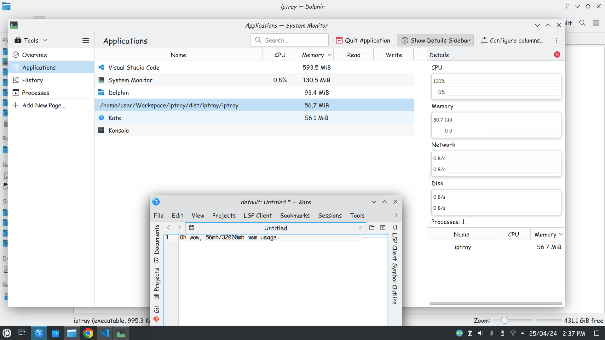

# *iptray*
## Overview
*iptray* is a lightweight and intuitive tray application designed to simplify the process of copying your public IP address to the clipboard. With a single click, you can effortlessly grab your public IP and have it ready for use wherever you need it. Say goodbye to tedious manual copying and embrace the convenience of *iptray*!

## Features
**Effortless IP Copying**: With *iptray*, copying your public IP address is a breeze. Simply click on the tray icon, and your IP is instantly copied to your clipboard.

**Minimalist Design**: *iptray* boasts a sleek and unobtrusive design, sitting quietly in your tray until you need it. No clutter, no distractions – just pure functionality.

**Always Accessible**: *iptray* runs quietly in the background, ensuring that your public IP is just a click away at all times. No need to launch any additional applications or perform complicated steps.

**Cross-Platform Compatibility**: *iptray* is built with cross-platform compatibility in mind, supporting Windows, macOS(compile it yourself 😁✌), and Linux. No matter your operating system of choice, *iptray* has got you covered.

## Screenshot

## Installation
To install *iptray*, simply download the latest release for your operating system from the Releases section of this repository. Extract the zip file and run the executable.

## Usage
Once *iptray* is installed and running, you'll find its icon in your system tray. To copy your public IP address to the clipboard, simply click on the *iptray* icon. That's it! Your IP address will be instantly copied, and you can paste it wherever you need it.

## Customization
*iptray* offers a few customization options to tailor the app to your preferences:

[Not Implemented] Startup Behavior: You can choose whether *iptray* starts automatically when your system boots up or remains manual. Simply right-click on the tray icon and select "Startup Behavior" to make your choice.

[Not Implemented] Tray Icon Appearance: Want to change the look of the tray icon? Right-click on the icon and select "Tray Icon Appearance" to choose from a variety of themes.

## Contributing
Contributions are welcome! If you have suggestions, bug reports, or feature requests, feel free to create an issue or submit a pull request. But nothing absurd.

## License
*iptray* is licensed under the MIT License. See LICENSE for more information.
